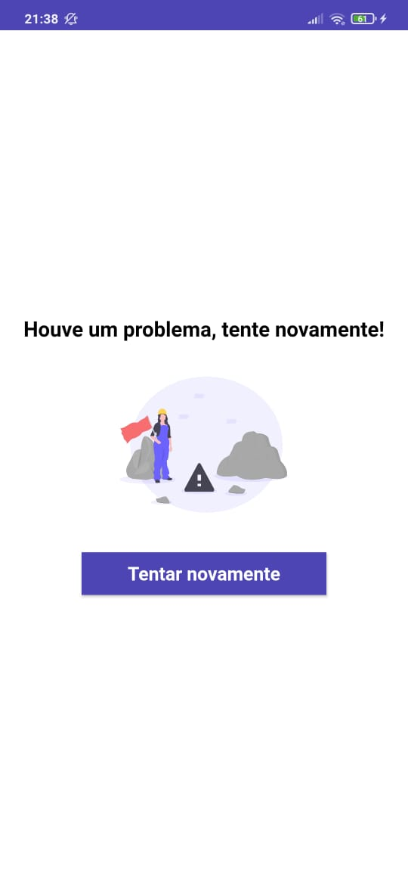

# GitHub Repositories

Este aplicativo tem como objetivo a exibição do 100 primeiros repositórios do GitHub.

# O aplicativo foi desenvolvido utilizando:
Programação Modular, pois torna o código sustentável e reutilizável e facilita a injeção de dependência;
MobX como gerenciador de estado;
Dartz para trabalhar com as respostas das requisições;
Dio para executar as requisições para APIs;
Inversão de Controle;
Injeção de Dependências;
Testes Unitários;
Testes Instrumentados;
TDD.

## Bibliotecas utilizadas
flutter_modular: Utilizada para modularizar o aplicativo, facilitar injeção de dependências;
flutter_mobx e mobx: Utilizados para o gerenciamento do estado;
dio: Executar requisições para APIs;
dartz: Utilizada para facilitar o tratamento das respostas das APIs, utilizando o Either;
cached_network_image: Utilizada para fazer o cache das imagens e melhorar a experiência do usuário;
connectivity: Utilizada para a chegagem de conexão;
url_launcher: Utilizada para abrir os repositórios no browser;
shimmer: Utilizada para implementar as animações de loading de repositórios;
fluttertoast: Utilizada para exibir toast caso não seja possível abrir o repositório ou o dispositivo;

## Bibliotecas para testes
flutter_test: Executar testes unitários;
flutter_driver: Executar testes instrumentados;
test: Para usar funções de teste e asserções reais.


## Como executar os testes
Para executar os testes unitários:
 -Entre na pasta test na raiz do projeto
 -Abra um arquivo que deseja executar os testes 
 -Clique em "Run"
 
Para executar os testes instrumentados: 
 -Com um emulador ou um dispositivo conectado 
 -Na raiz do projeto execute o seguinte comando: 
```
$ flutter drive --target=test_driver/app.dart
```

## O aplicativo




## 🤓 Author

**William Tristão de Paula**  [Profile](https://github.com/williamtdepaula "GitHub Profile")

## Configuration Steps

Cloning the repository:
```
$ git clone https://github.com/williamtdepaula/flutter_github_repositories
```

Open the project:
```
$ cd flutter_github_repositories
```

Now run the app on your connected device (using terminal):
```
$ flutter run